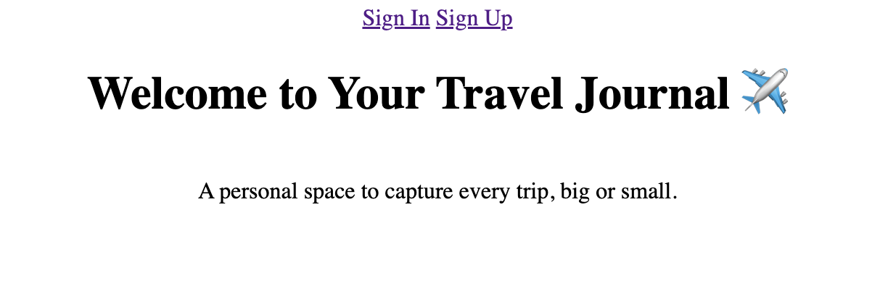

🌍 My Journeys

✈️ Description

My Journeys is a full-stack MEN (MongoDB, Express, Node.js) CRUD application that allows users to create and manage a personal travel journal. After signing up and signing in, users can record trips they’ve taken or are planning by adding details such as location, dates, category, and notes.

The application uses session-based authentication and embedded data modeling with Mongoose, storing each user’s trips directly inside their user document.

🚀 Getting Started
🔗 Deployed Application

Live App:
https://my-journals-e55cf5984a23.herokuapp.com/

📋 Planning Materials

User stories, ERD, and route planning were completed prior to development

Embedded data modeling followed General Assembly MEN Stack conventions

🧭 Features

User authentication (Sign Up, Sign In, Sign Out)

Protected routes using authorization middleware

Full CRUD functionality for trips:

Create a trip

View all trips

View a single trip

Edit a trip

Delete a trip

Embedded trip data within the User model

Dynamic views rendered with EJS templates

Shared navigation bar using partials

🛠️ Technologies Used

JavaScript

Node.js

Express

MongoDB

Mongoose

EJS

CSS

Express-Session

Method-Override

Heroku

🔐 Authorization & Security

Only authenticated users can access trip routes

Authorization middleware prevents anonymous access

Users can only create, edit, or delete their own trips

Session data is securely stored using MongoDB

🎨 UI / UX

Consistent navigation bar across all pages

Clean and readable layout

Forms are pre-filled when editing a trip

Navigation is handled through links (no manual URL entry required)

Buttons are clearly labeled and styled

Accessible contrast and readable text

🔮 Next Steps (Future Enhancements)

Add images to trips

Implement trip filtering by category

Improve styling with CSS Grid and Flexbox

Add a public “Explore Journeys” feature

Integrate maps for trip locations

📚 Attributions

General Assembly MEN Stack curriculum

Mongoose and Express documentation

👩‍💻 Author

Rebecca Nampewo
